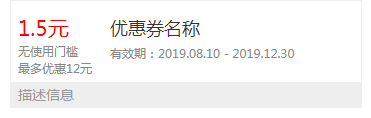

# 介绍

> 优惠券展示组件，一行展示一张优惠券。

## 预览


## 引用
```json
"usingComponents": {
  "em-goods": "path/to/blocks/coupon-yf/couponstyle"
}
```

## 案例

基本使用方法
```html
<yz-coupon-style
    describe="描述信息"
    price="1.5元"
    limit="无使用门槛"
    detail="最多优惠12元"
    name="优惠券名称"
    effective="有效期：2019.08.10 - 2019.12.30"
  >
</yz-coupon-style>
```

## 属性

| 属性 | 说明 | 类型 | 默认值 |
| --- | --- | --- | --- |
| switcherac | 是否为激活状态，即字体是否显示红色 | String,Boolean | "true" |
| describe | 底部描述信息 | String | null |
| price | 折扣价 | String | null |
| limit | 使用门槛限制 | String | null |
| detail | 如：最多优惠12元 | String | null |
| name | 优惠券名称 | String | null |
| effective | 如：有效期：2019.08.10 - 2019.12.30 | String | null |

## 事件

|事件名	| 说明 | 参数|
| --- | --- | --- |
|onclick	| 暂时没有 | |
